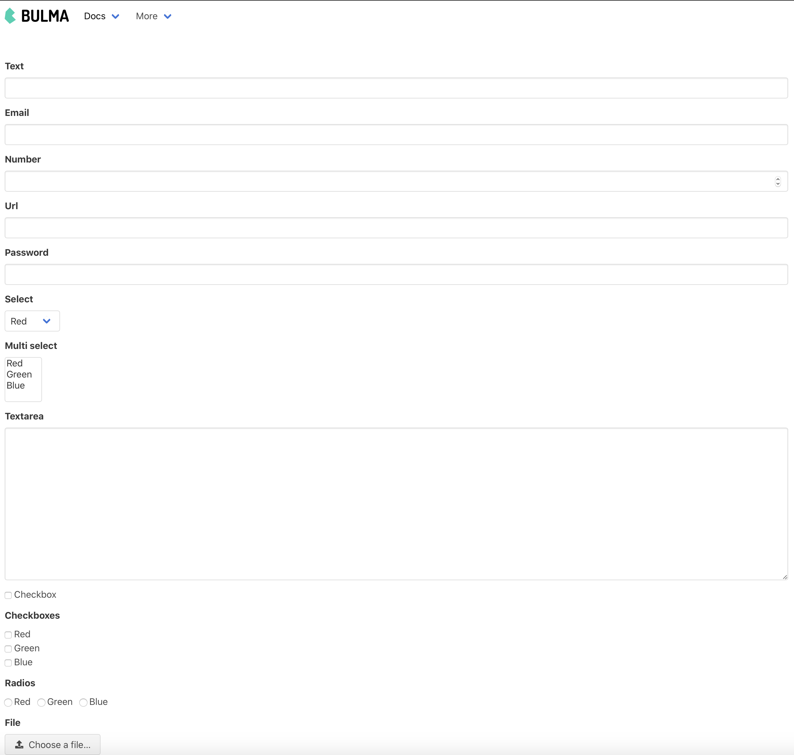

# django-bulma
Django example with bulma CSS templates

See HTML, view and requirement and settings files.
To see an example run `python manage.py runserver` and go to `http://localhost:8000/app1/form`.

